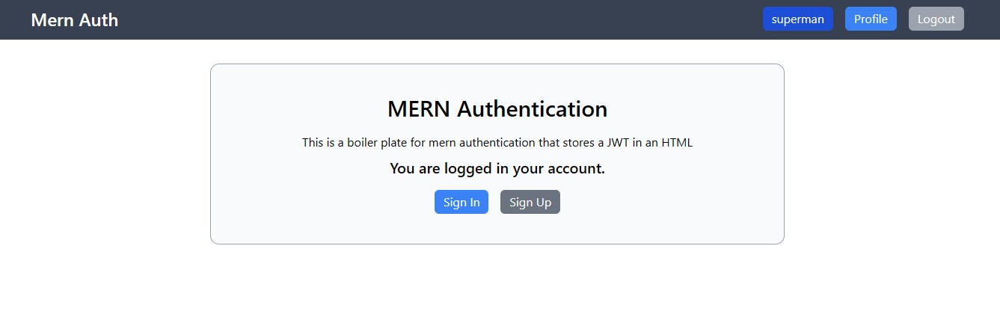

# MERN Authentication & API Integration Project  

This project is designed to teach and reinforce key concepts in building a full-stack MERN (MongoDB, Express, React, Node.js) application with authentication, backend route creation, controller setup, and frontend API integration using Redux Toolkit's `createApi` (`apiSlice`) with `useEndpoints` and `mutations`.  

## Features  

### Backend (Node.js, Express, MongoDB)  
- User authentication with JWT   
- Secure password hashing with bcryptjs  
- Middleware for authentication and error handling  
- Modular controller and route structure  
- MongoDB database connection using Mongoose  

### Frontend (React, Redux Toolkit)  
- State management with Redux Toolkit  
- API calls using `createApi` (RTK Query)  
- Authentication with login/register functionality  
- Protected routes with React Router  
- UI state handling (loading, error, success messages)  

---

## 🛠️ Setup Instructions  

### 1️⃣ Backend Setup  
#### Prerequisites  
Ensure you have **Node.js** and **MongoDB** installed.  

#### Installation  
```bash
git clone <repo-url>
cd backend
npm install
```

#### Configure Environment Variables  
Create a `.env` file in the `backend` directory and add the following:  
```
PORT=5000
MONGO_URI=your_mongodb_uri
JWT_SECRET=your_jwt_secret
```

#### Run the Server  
```bash
npm run server
```
The backend will run at `http://localhost:5000`.

---

### 2️⃣ Frontend Setup  
#### Prerequisites  
Ensure you have **Node.js** installed.  

#### Installation  
```bash
cd frontend
npm install
```

#### Start the React App  
```bash
npm run both
```
The frontend will run at `http://localhost:3000`.

---

## 🔧 API Endpoints  

**POST      /api/users**            - Register a user
**POST      /api/users/auth**       - Authentication a user and get token
**POST      /api/users/logout**     - Logout user and clear cookie
**GET       /api/users/profile**    - Get User profile (protected)
**PUT       /api/users/profile**    - Update profile (protected)

## 📂 Folder Structure  

```
mern-auth-project/
│
├── backend/
│
├── frontend/
│
├── public/             # Static assets  
├── .env                # Environment variables  
└── package.json        # Dependencies and scripts  
```

---

## 🔥 Key Technologies Used  

### Backend  
- Node.js, Express.js  
- MongoDB, Mongoose  
- JWT Authentication  
- Bcryptjs for password hashing  
- Dotenv for environment variables  

### Frontend  
- React.js  
- Redux Toolkit (State Management)  
- RTK Query (`apiSlice`, `useMutation`, `useQuery`)  
- React Router for navigation  

---

## 🚀 Future Improvements  
- Refresh token mechanism  
- OAuth (Google, GitHub) authentication  
- Profile management (edit profile, upload avatars)  

---

## 💡 Learning Outcomes  
By completing this project, you will understand:  
✅ How to set up authentication in a MERN stack app  
✅ How to structure backend routes and controllers  
✅ How to integrate Redux Toolkit with API calls  
✅ How to handle protected routes in React  

---


## 📝 License  
This project is open-source and available under the MIT License. 

